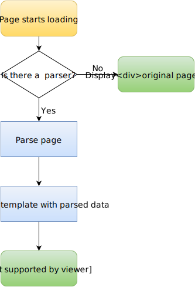

## Overview

Moy.Design, or Moy for short, allows you to change the appearance of your favorite websites. To make it happen, you need three things:

1. A [parser](#parser) extracts information from websites;
2. A [template](#template) represents the parsed data the way you want;
3. A [binding](#binding) links certain websites with parsers and templates.

The general flow is like this:

All the work is done on the client side for security reasons, so you also need a browser plugin ([Chrome](/extension/chrome), [Firefox](/extension/firefox)). When you're opening a website, the plugin checks whether it has a binding. If yes, the plugin prevents normal loading, and loads only the data necessary for the parser. Typically, it's only the main page and images, without scripts, stylesheet, fonts, etc - which speeds up loading. Next, the parser reads the data and extracts important information from it. The output of the parser is a number of named HTML strings. The template gets the parser's output and forms the final HTML document from it by putting named HTML strings into appropriate places. The final page is then shown instead of the original page.

Parsers and templates are separate entities. They don't strictly depend on each other, and may be written and used separately. For instance, you can use one template with many parsers.

