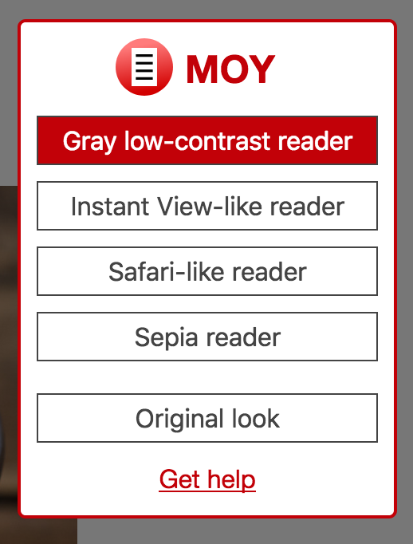

| Prev | Moy.Design Documentation          | Next                        |
| ---- |:---------------------------------:| --------------------------- |
| [Overview](overview.md#overview) | [Contents](../README.md#contents) | [Parser](parser.md#parser) |

# Browser plugin

Websites data is never sent anywhere. **Parsing and templating are done on the client (in your browser).** This means you can use Moy even for websites with sensitive data. This also means you need to install a browser plugin.

The plugin's available for Chrome and Firefox (including Firefox for Android).

* [Install for Chrome](https://chrome.google.com/webstore/detail/moydesign/kgepfphemgiidklhpnfoobmoieiglgon)
* [Install for Firefox](https://moy.design/extension/firefox)

If everything's OK, you should see something like this next time you click the plugin's icon:

These buttons represent alternative looks (templates) available for this page. For some pages, only `Original look` is available. When you press a button, the page will be reloaded with the chosen look, and your choice is remembered. I.e. next time you load this (or similar) page, it'll be shown with the selected template.

| Prev | Moy.Design Documentation          | Next                        |
| ---- |:---------------------------------:| --------------------------- |
| [Overview](overview.md#overview) | [Contents](../README.md#contents) | [Parser](parser.md#parser) |
